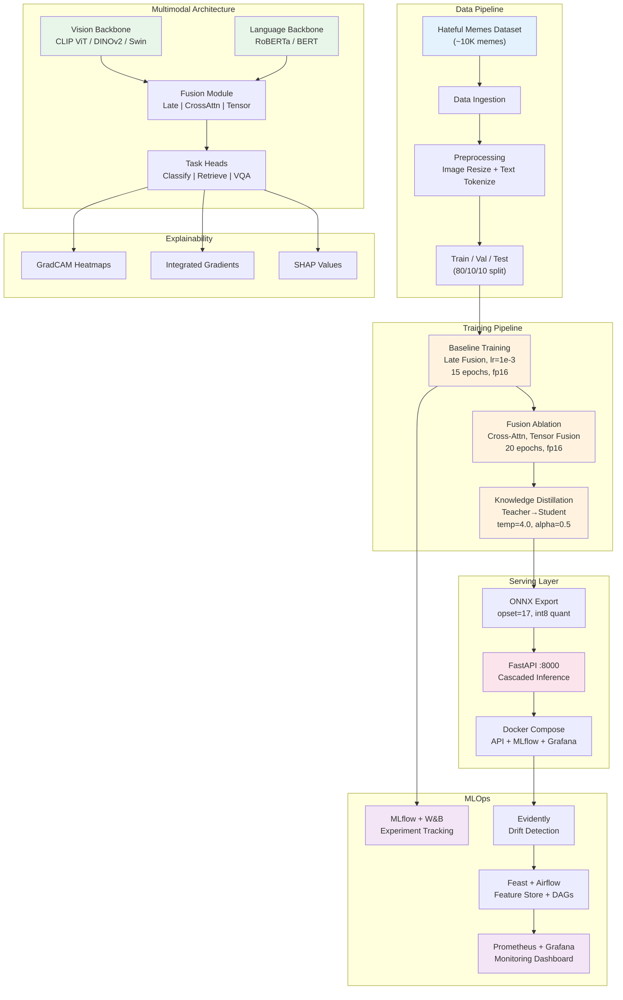

# MultiGuard -- Multimodal Content Intelligence Pipeline

[](https://python.org)
[](https://pytorch.org)
[](https://huggingface.co)
[](https://fastapi.tiangolo.com)
[](LICENSE)
[](https://github.com/zubairashfaque/multiguard/actions/workflows/ci.yml)
[](https://wandb.ai)
[](https://mlflow.org)
[](https://docker.com)

---

## Overview

**MultiGuard** is a production-grade multimodal content intelligence system that ingests text + images (memes, social media posts, product listings) and performs classification, retrieval, and explainability through a complete ML engineering pipeline:

> **Vision Backbone** &rarr; **Language Backbone** &rarr; **Multimodal Fusion** &rarr; **Task Heads** &rarr; **Explainability** &rarr; **FastAPI / Docker Serving**

The project demonstrates an end-to-end workflow -- from data ingestion and multimodal model training to fusion ablation, knowledge distillation, and containerized serving -- trained on a **Tesla P100-PCIE-16GB** (Kaggle) with FP16 mixed precision.

### What Makes This Project Different

| Aspect | Detail |
|--------|--------|
| **Multimodal fusion** | Vision + language backbones with 3 fusion strategies in a single codebase |
| **3 fusion strategies** | Late fusion, cross-attention (4-layer bidirectional), tensor fusion (low-rank) |
| **Multi-task heads** | Classification, retrieval (InfoNCE), and VQA from a shared representation |
| **Cascaded inference** | CLIP zero-shot fast filter &rarr; full model for accurate prediction |
| **Explainability-first** | GradCAM heatmaps, Integrated Gradients, SHAP for every prediction |
| **Full MLOps** | MLflow + W&B tracking, Feast feature store, Evidently drift detection, Airflow DAGs |
| **Production monitoring** | Prometheus + Grafana dashboards, Redis caching, automatic retraining triggers |

---

## Key Results

| Model Variant | Fusion | AUROC | F1 | Accuracy | Params (M) | Size (MB) |
|:--------------|:-------|:-----:|:--:|:--------:|:----------:|:---------:|
| Baseline | Late (concat + MLP) | 0.6440 | 0.5876 | 0.5880 | 297.9 | 807.8 |
| **Cross-Attention** | **Bidirectional 4-layer** | **0.6567** | **0.6299** | **0.6300** | **310.8** | **857.2** |
| Tensor Fusion | Low-rank (rank=32) | 0.6502 | 0.5953 | 0.5980 | 297.4 | 805.7 |
| Distilled Student | Late (small) | 0.6244 | 0.5221 | 0.5640 | 86.7 | 331.1 |

> *Trained on Kaggle (Tesla P100-PCIE-16GB) with FP16 mixed precision. Cross-attention achieves best AUROC (0.6567). Student retains 95% of teacher AUROC at 2.6x compression and 4.3x faster inference.*

**Dataset:** [Facebook Hateful Memes Challenge](https://ai.facebook.com/tools/hatefulmemes/) (~10K memes, binary labels)

---

## Architecture



### Pipeline Stage Details

<table>
<tr>
<th>Stage</th>
<th>Method</th>
<th>Key Hyperparameters</th>
<th>Compute</th>
</tr>
<tr>
<td><strong>Baseline Training</strong></td>
<td>CLIP ViT + RoBERTa with late fusion (concat + MLP)</td>
<td>

- Vision: CLIP ViT-B/16 (512-dim)
- Language: roberta-base (768-dim)
- Fusion: concat → 2-layer MLP with dropout
- LR: 1e-3, cosine schedule, warmup ratio 0.1
- Batch: 32, 15 epochs
- FP16 mixed precision

</td>
<td>Tesla P100-PCIE-16GB</td>
</tr>
<tr>
<td><strong>Fusion Ablation</strong></td>
<td>Cross-attention and tensor fusion comparison (3 seeds)</td>
<td>

- Cross-attention: 4 layers, 8 heads, gated combination
- Tensor fusion: rank=32, low-rank outer product
- LR: 5e-4, cosine schedule
- Batch: 32, 20 epochs
- FP16 mixed precision

</td>
<td>Tesla P100-PCIE-16GB</td>
</tr>
<tr>
<td><strong>Knowledge Distillation</strong></td>
<td>Teacher (best fusion) &rarr; Student (efficient backbones)</td>
<td>

- Teacher: best fusion model (frozen)
- Student: EfficientNet-B0 + DistilRoBERTa (late fusion)
- Temperature: 4.0, Alpha: 0.5
- LR: 1e-3, 20 epochs, batch 32 (grad_accum=2)
- KL divergence + hard label loss

</td>
<td>Tesla P100-PCIE-16GB</td>
</tr>
<tr>
<td><strong>ONNX Export</strong></td>
<td>ONNX export with dynamic quantization</td>
<td>

- Opset version: 17
- Dynamic int8 quantization
- TorchScript: disabled
- Optimized for CPU inference

</td>
<td>~5-10 min</td>
</tr>
</table>

---

## Quick Start

### Prerequisites

| Requirement | Minimum | How to Check |
|-------------|---------|--------------|
| Python | 3.10+ | `python3 --version` |
| Poetry | 2.0+ | `poetry --version` |
| Git | Any recent | `git --version` |
| NVIDIA GPU | 16+ GB VRAM (Tesla P100 / RTX 3090+) | `nvidia-smi` |
| NVIDIA Drivers | 525+ | `nvidia-smi` (top row) |
| CUDA Toolkit | 12.1+ | `nvcc --version` |

> **CPU-only mode:** Training requires a GPU, but inference is supported on CPU using ONNX-quantized models (see ONNX Export stage).

### Step 1: Clone the Repository

```bash
git clone https://github.com/zubairashfaque/multiguard.git
cd multiguard
```

### Step 2: Install Poetry (if not installed)

```bash
curl -sSL https://install.python-poetry.org | python3 -
# Or: pipx install poetry

# Verify:
poetry --version
```

### Step 3: Install Dependencies

**Option A -- Using Make (recommended):**

```bash
make install
# Runs: poetry install && poetry run pre-commit install
```

**Option B -- Manual:**

```bash
# Install all dependencies (production + dev)
poetry install

# Activate the virtual environment
poetry shell

# Install pre-commit hooks
pre-commit install
```

> **Note:** All commands in this guide use `poetry run <command>` to ensure they run inside the Poetry virtual environment. Alternatively, you can activate the environment once with `poetry shell` and then run commands directly (without the `poetry run` prefix). The `make` targets already handle this for you.

### Step 4: Set Up Environment Variables

```bash
cp .env.example .env
```

Edit `.env` and fill in your actual API keys:

| Variable | Where to Get It | Required For |
|----------|----------------|--------------|
| `WANDB_API_KEY` | https://wandb.ai/authorize | Experiment tracking |
| `WANDB_PROJECT` | Your choice (default: `multiguard`) | W&B project name |
| `WANDB_ENTITY` | Your W&B username | W&B entity |
| `HF_TOKEN` | https://huggingface.co/settings/tokens | Downloading gated models |
| `MLFLOW_TRACKING_URI` | Default: `http://localhost:5000` | MLflow experiment tracking |

Load the variables into your shell:

```bash
export $(grep -v '^#' .env | xargs)
```

### Step 5: Verify Installation

```bash
# Check PyTorch and CUDA
poetry run python -c "import torch; print(f'PyTorch: {torch.__version__}, CUDA available: {torch.cuda.is_available()}')"

# Check key libraries
poetry run python -c "from transformers import CLIPModel; print('CLIP ready')"
poetry run python -c "from captum.attr import IntegratedGradients; print('Captum ready')"

# Run unit tests
make test
```

All unit tests should pass. If CUDA shows `False`, see [Troubleshooting](#troubleshooting-setup) below.

### Step 6: Log In to Hugging Face

```bash
poetry run hf auth login --token $HF_TOKEN
```

Required to download gated models from Hugging Face.

> **Note:** In `huggingface_hub` v1.x, the CLI was renamed from `huggingface-cli` to `hf`. If you see `Command not found: huggingface-cli`, use `hf auth login` instead.

### Step 7: Log In to Weights & Biases

```bash
poetry run wandb login $WANDB_API_KEY
```

### Full Pipeline (Train &rarr; Evaluate &rarr; Serve)

```bash
# 1. Download and preprocess the Hateful Memes dataset
make ingest

# 2. Train baseline model with late fusion (~2-4 hours on RTX 3090)
make train-baseline

# 3. Run fusion ablation: cross-attention + tensor fusion (~4-6 hours)
make train-fusion

# 4. Knowledge distillation: teacher → student (~1-2 hours)
make train-distill

# 5. Run evaluation benchmarks
make evaluate

# 6. Export to ONNX with int8 quantization
make export-onnx

# 7. Launch the API
make serve            # FastAPI at localhost:8000
```

### Docker Deployment

```bash
# Build and launch full stack (API + MLflow + Redis + Prometheus + Grafana)
make serve-docker

# Services:
#   API:        http://localhost:8000
#   MLflow:     http://localhost:5000
#   Grafana:    http://localhost:3000
#   Prometheus: http://localhost:9090
#   Redis:      localhost:6379
#   Health:     http://localhost:8000/health
```

### Troubleshooting Setup

<details>
<summary><strong>CUDA not detected (<code>torch.cuda.is_available()</code> returns False)</strong></summary>

1. Verify your NVIDIA driver is installed: `nvidia-smi`
2. Ensure CUDA toolkit is installed: `nvcc --version`
3. Reinstall PyTorch with CUDA support:
   ```bash
   poetry run pip install torch --index-url https://download.pytorch.org/whl/cu121
   ```
4. Check that the CUDA version matches your driver (see the [PyTorch compatibility matrix](https://pytorch.org/get-started/locally/))

</details>

<details>
<summary><strong><code>make install</code> fails with permission errors</strong></summary>

Ensure Poetry is installed and accessible:
```bash
poetry --version
poetry env info   # Check virtual environment location
```

</details>

<details>
<summary><strong>Hugging Face download fails (403 / gated model)</strong></summary>

1. Visit the model page on Hugging Face and accept the license agreement
2. Verify your token: `poetry run hf auth whoami`
3. Re-login: `poetry run hf auth login --token $HF_TOKEN`

</details>

<details>
<summary><strong>Out of memory (OOM) during training</strong></summary>

- Reduce `per_device_train_batch_size` in `configs/train/baseline.yaml` or `fusion_ablation.yaml`
- Ensure no other processes are using the GPU: `nvidia-smi`
- The default config targets 24 GB VRAM; GPUs with less memory need smaller batch sizes
- Try reducing image resolution in `configs/data/preprocessing.yaml`

</details>

<details>
<summary><strong>Poetry not found</strong></summary>

Install Poetry:
```bash
curl -sSL https://install.python-poetry.org | python3 -
# Or: pipx install poetry
```

If already installed but not in PATH:
```bash
export PATH="$HOME/.local/bin:$PATH"
```

</details>

---

## API Reference

### `POST /api/v1/predict` -- Classify Multimodal Content

```bash
curl -X POST http://localhost:8000/api/v1/predict \
  -H "Content-Type: application/json" \
  -d '{
    "text": "This is some text content",
    "image_url": "https://example.com/image.jpg",
    "threshold": 0.5
  }'
```

**Response:**
```json
{
  "label": "hateful",
  "confidence": 0.87,
  "probabilities": {"hateful": 0.87, "benign": 0.13},
  "model": "multiguard-cross-attention",
  "cascade_stage": "full_model"
}
```

### `GET /health` -- Health Check

```bash
curl http://localhost:8000/health
```
```json
{"status": "healthy", "model_loaded": true, "version": "0.1.0"}
```

### `POST /api/v1/embed` -- Generate Multimodal Embeddings

```bash
curl -X POST http://localhost:8000/api/v1/embed \
  -H "Content-Type: application/json" \
  -d '{"text": "Sample text", "image_url": "https://example.com/image.jpg"}'
```
```json
{
  "embedding": [0.012, -0.034, 0.056, "..."],
  "dimension": 256,
  "model": "multiguard"
}
```

### `POST /api/v1/explain` -- Per-Prediction Explainability

```bash
curl -X POST http://localhost:8000/api/v1/explain \
  -H "Content-Type: application/json" \
  -d '{"text": "Sample text", "image_url": "https://example.com/image.jpg"}'
```
```json
{
  "prediction": {"label": "hateful", "confidence": 0.87},
  "gradcam_heatmap": "base64-encoded-image",
  "token_attributions": [{"token": "hate", "score": 0.45}, {"token": "this", "score": 0.02}],
  "method": "integrated_gradients"
}
```

---

## Training Data

MultiGuard is trained on the **Facebook Hateful Memes Challenge** dataset:

| Dataset | Source | Samples | Content |
|---------|--------|--------:|---------|
| Hateful Memes | Facebook Research | ~10,000 | Memes with text overlays, binary hateful/benign labels |

### Preprocessing Pipeline

1. **Image Validation** -- Verify format, resize to 224x224, CLIP normalization
2. **Text Cleaning** -- Unicode normalization, whitespace normalization
3. **Hash Deduplication** -- Remove near-duplicate image-text pairs
4. **Length Filtering** -- Remove entries with text <10 or >512 characters
5. **Stratified Splitting** -- 80% train / 10% validation / 10% test

### Augmentation

**Image augmentations** (via Albumentations):
- `RandomResizedCrop` (224x224, scale 0.8-1.0)
- `HorizontalFlip` (p=0.5)
- `ColorJitter` (brightness 0.2, contrast 0.2, saturation 0.2, hue 0.1)
- `RandomErasing` (p=0.1, scale 0.02-0.33)

**Text augmentations:**
- `SynonymReplacement` (p=0.1, max_replacements=2)
- `RandomDeletion` (p=0.1)

**Multimodal augmentations:**
- `Mixup` (alpha=0.2)
- `CutMix` (alpha=1.0)

---

## Configuration System

All hyperparameters are externalized into YAML files -- **nothing is hardcoded in source code**. Configs support variable interpolation and hierarchical merging via [OmegaConf](https://omegaconf.readthedocs.io/).

```
configs/
├── base.yaml                      # Shared defaults (seed=42, device, logging, paths)
├── train/
│   ├── baseline.yaml              # Late fusion: lr=1e-3, batch=32, 15 epochs
│   ├── fusion_ablation.yaml       # Cross-attention + tensor: lr=5e-4, 20 epochs
│   └── distillation.yaml          # KD: temp=4.0, alpha=0.5, lr=1e-3, 20 epochs
├── model/
│   ├── backbone.yaml              # Vision (CLIP/ViT/DINOv2/Swin) + Language (RoBERTa/BERT)
│   ├── fusion.yaml                # Late | CrossAttn (4L, 8H) | Tensor (rank=32)
│   └── heads.yaml                 # Classifier (2 labels) | Retrieval (256-dim) | VQA (3129)
├── data/
│   ├── preprocessing.yaml         # Image 224x224, text max_length=77, 80/10/10 split
│   └── augmentation.yaml          # Image, text, and multimodal augmentations
├── inference/
│   ├── serving.yaml               # API config, cascade, rate limits (60 req/min)
│   └── quantization.yaml          # ONNX opset=17, dynamic int8
└── experiment/
    ├── baseline.yaml              # Evaluate baseline (CLIP + RoBERTa + late fusion)
    └── ablation_fusion.yaml       # Fusion ablation study
```

**Example -- overriding config at runtime:**
```bash
# Train with different learning rate
python scripts/train.py --config configs/train/baseline.yaml
# Config values can be composed and overridden programmatically via OmegaConf
```

---

## Project Structure

```
multiguard/
│
├── .github/workflows/
│   ├── ci.yml                        # PR: lint (ruff, black, mypy) + unit tests + codecov
│   └── cd.yml                        # On tag v*: build & push Docker images to ghcr.io
│
├── configs/                          # ALL hyperparameters (never hardcoded)
│   ├── base.yaml                     # Shared: seed=42, fp16, W&B project, paths
│   ├── train/baseline.yaml           # Late fusion: lr=1e-3, batch=32, 15 epochs
│   ├── train/fusion_ablation.yaml    # Cross-attn + tensor: lr=5e-4, 20 epochs
│   ├── train/distillation.yaml       # KD: temp=4.0, alpha=0.5, lr=1e-3
│   ├── model/backbone.yaml           # CLIP ViT / DINOv2 / Swin + RoBERTa / BERT
│   ├── model/fusion.yaml             # Late | CrossAttn (4L, 8H) | Tensor (rank=32)
│   ├── model/heads.yaml              # Classifier | Retrieval | VQA heads
│   ├── data/preprocessing.yaml       # Image 224x224, text 77 tokens, 80/10/10
│   ├── data/augmentation.yaml        # Image/text/multimodal augmentations
│   ├── inference/serving.yaml        # Cascade, rate limits, timeout
│   ├── inference/quantization.yaml   # ONNX opset=17, int8 quantization
│   └── experiment/*.yaml             # Baseline and ablation eval configs
│
├── data/                             # DVC-tracked (not in Git)
│   ├── raw/                          # Untouched source data
│   ├── processed/{train,val,test}/   # Cleaned, split, preprocessed
│   ├── features/                     # Image + text embeddings
│   └── external/                     # External data sources
│
├── src/                              # Importable Python package
│   ├── data/
│   │   ├── loaders.py                # MultimodalDataset, build_dataloader()
│   │   ├── preprocessing.py          # Image resize + normalization, text tokenization
│   │   ├── augmentation.py           # Albumentations + text + multimodal augmentations
│   │   ├── tokenizers.py             # Text tokenization utilities
│   │   ├── splitters.py              # Stratified train/val/test splitting
│   │   └── validators.py             # Data validation and integrity checks
│   ├── models/
│   │   ├── backbones/
│   │   │   ├── clip.py               # CLIPBackbone, SigLIPBackbone (joint vision-language)
│   │   │   ├── vision.py             # ViTBackbone, DINOv2Backbone, SwinBackbone
│   │   │   └── language.py           # RoBERTaBackbone, BERTBackbone
│   │   ├── fusion/
│   │   │   ├── late_fusion.py        # LateFusion: concat + MLP
│   │   │   ├── cross_attention.py    # CrossAttentionFusion: 4-layer, 8-head, gated
│   │   │   └── tensor_fusion.py      # TensorFusion: low-rank outer product (rank=32)
│   │   ├── heads/
│   │   │   ├── classifier.py         # ClassificationHead: binary/multi-class + label smoothing
│   │   │   ├── retrieval.py          # RetrievalHead: embedding projection (256-dim)
│   │   │   └── vqa.py                # VQAHead: 3129-answer vocabulary
│   │   ├── losses.py                 # MultiTaskLoss (learnable weights), InfoNCELoss, FocalLoss
│   │   └── model_factory.py          # MultiGuardModel, build_model(config)
│   ├── training/
│   │   ├── trainer.py                # MultimodalTrainer: train_epoch(), validate(), checkpoint
│   │   ├── distillation_trainer.py   # DistillationTrainer: KD with temp=4.0, alpha=0.5
│   │   ├── callbacks.py              # CheckpointCallback, EarlyStoppingCallback
│   │   ├── optimizers.py             # AdamW + cosine scheduler with warmup
│   │   └── metrics.py                # Training accuracy, F1, loss tracking
│   ├── evaluation/
│   │   ├── benchmarks/
│   │   │   └── hateful_memes.py      # Hateful Memes benchmark evaluation
│   │   ├── evaluator.py              # Evaluation orchestrator, logs to W&B + MLflow
│   │   ├── metrics.py                # compute_auroc(), compute_mrr_at_k()
│   │   └── comparison.py             # Model-vs-model comparison table generator
│   ├── explainability/
│   │   ├── gradcam.py                # GradCAM heatmap generation (hook-based)
│   │   ├── integrated_gradients.py   # Integrated Gradients attribution (via Captum)
│   │   ├── shap_explainer.py         # SHAP explanations for multimodal inputs
│   │   └── visualizer.py             # Heatmap overlay and attribution visualization
│   ├── serving/
│   │   ├── app.py                    # FastAPI factory with routers
│   │   ├── routes/
│   │   │   ├── predict.py            # POST /api/v1/predict
│   │   │   ├── health.py             # GET /health, /ready
│   │   │   ├── embed.py              # POST /api/v1/embed
│   │   │   └── explain.py            # POST /api/v1/explain (GradCAM + token attribution)
│   │   ├── schemas.py                # Pydantic v2: PredictionRequest/Response, EmbeddingResponse
│   │   ├── model_loader.py           # Lazy model loading with state management
│   │   └── middleware.py             # Request/response middleware
│   ├── monitoring/
│   │   ├── drift_detector.py         # DriftDetector: Evidently-based distribution monitoring
│   │   ├── feature_monitor.py        # FeatureMonitor: quality tracking + anomaly detection
│   │   ├── retraining_trigger.py     # Automatic retraining decision logic
│   │   └── alerting.py               # Alert triggering and notification
│   └── utils/
│       ├── config.py                 # OmegaConf loader with caching and defaults merging
│       ├── seed.py                   # set_seed(42) across torch/numpy/random/CUDA
│       ├── device.py                 # GPU detection, VRAM monitoring
│       ├── logging.py                # Loguru + optional W&B init
│       ├── io.py                     # JSON/YAML/pickle save/load helpers
│       └── registry.py               # Registry pattern (BACKBONE, FUSION, HEAD, TRAINER, etc.)
│
├── scripts/                         # CLI entry points
│   ├── train.py                     # Training dispatcher (baseline/fusion/distillation)
│   ├── evaluate.py                  # Run benchmarks for a single model
│   ├── run_benchmark.py             # Compare all model checkpoints (--all-checkpoints)
│   ├── ingest_data.py               # Download & preprocess Hateful Memes dataset
│   ├── export_model.py              # Export to ONNX (--format onnx)
│   └── build_feature_store.py       # Feast feature store setup
│
├── tests/                           # Unit, integration, smoke tests
│   ├── conftest.py                  # Fixtures: tiny_config, dummy multimodal dataset
│   ├── unit/                        # Unit tests -- fast, CPU-only, mocked externals
│   │   ├── test_data_loaders.py     # MultimodalDataset, build_dataloader
│   │   ├── test_preprocessing.py    # Data preprocessing pipeline
│   │   ├── test_models.py           # Backbone, fusion, head unit tests
│   │   ├── test_losses.py           # MultiTaskLoss, InfoNCELoss, FocalLoss
│   │   └── test_metrics.py          # compute_auroc, compute_mrr_at_k
│   ├── integration/                 # FastAPI TestClient + training loop tests
│   │   ├── test_serving_api.py      # Health, predict, embed, explain endpoints
│   │   └── test_training_loop.py    # End-to-end training loop verification
│   └── smoke/                       # End-to-end pipeline verification
│       └── test_full_pipeline.py    # Config → preprocess → train → evaluate → export
│
├── infrastructure/
│   ├── docker/
│   │   ├── Dockerfile.serve         # PyTorch 2.1.0 + CUDA 12.1 (lightweight serving)
│   │   ├── Dockerfile.train         # GPU training container
│   │   └── Dockerfile.monitor       # Monitoring/drift detection container
│   ├── docker-compose.yml           # api (:8000) + mlflow (:5000) + redis + prometheus + grafana
│   ├── airflow/
│   │   └── dags/
│   │       ├── ingestion_dag.py     # Data ingestion orchestration
│   │       ├── training_dag.py      # Training pipeline orchestration
│   │       └── drift_monitor_dag.py # Continuous drift monitoring
│   └── grafana/
│       └── dashboards/
│           └── model_monitoring.json # Model performance monitoring dashboard
│
├── models/                          # DVC-tracked (not in Git)
│   ├── checkpoints/                 # Training checkpoints (baseline, fusion, distilled)
│   ├── final/                       # Best models per fusion strategy
│   └── exported/                    # ONNX quantized models
│
├── reports/
│   ├── figures/                     # Generated plots (committed to Git)
│   ├── baseline_metrics.json        # Baseline model metrics
│   └── evaluation_metrics.json      # Evaluation comparison table
│
├── docs/
│   ├── architecture.md              # System design + Mermaid diagram
│   └── data_dictionary.md           # Column definitions for all datasets
│
├── notebooks/                       # Jupyter notebooks (numbered, import from src/)
├── Makefile                         # 16 targets: install, lint, test, train, evaluate, serve...
├── pyproject.toml                   # Poetry dependencies + tooling config
├── dvc.yaml                         # 3 DVC pipeline stages
├── .pre-commit-config.yaml          # black, ruff, isort, mypy hooks
├── .env.example                     # API key template
└── .gitignore                       # data/, models/, mlruns/, wandb/, .env
```

---

## Technology Stack

| Category | Technology | Version | Purpose |
|----------|-----------|---------|---------|
| **Vision Backbone** | CLIP ViT-B/16 | -- | Joint vision-language encoding |
| **Vision Alternative** | DINOv2 | -- | Self-supervised vision features (768-dim) |
| **Vision Alternative** | Swin Transformer | -- | Hierarchical vision features (1024-dim) |
| **Vision Models** | timm | >=0.9.0 | PyTorch Image Models (ViT, Swin, EfficientNet) |
| **CLIP** | open-clip-torch | >=2.24.0 | Open-source CLIP variants |
| **Language Backbone** | RoBERTa-base | -- | Text encoding (768-dim) |
| **Language Alternative** | BERT-base-uncased | -- | Text encoding (768-dim) |
| **Deep Learning** | PyTorch | >=2.1.0 | Core framework |
| **Transformers** | HuggingFace Transformers | >=4.36.0 | Model loading and tokenizers |
| **Fine-tuning** | PEFT (LoRA) | >=0.7.0 | Parameter-efficient fine-tuning |
| **Explainability** | Captum | >=0.7.0 | GradCAM, Integrated Gradients |
| **Explainability** | SHAP | >=0.44.0 | Shapley value explanations |
| **Experiment Tracking** | MLflow | >=2.10.0 | Metrics, params, artifacts |
| **Experiment Tracking** | Weights & Biases | >=0.16.0 | Training dashboards |
| **Feature Store** | Feast | >=0.35.0 | Feature management and serving |
| **Drift Detection** | Evidently | >=0.4.0 | Data and model drift monitoring |
| **Vector Search** | FAISS (CPU) | >=1.7.4 | Approximate nearest neighbor retrieval |
| **API** | FastAPI | >=0.108.0 | REST API (predict, health, embed, explain) |
| **UI** | Gradio | >=4.0.0 | Interactive demo interface |
| **Validation** | Pydantic v2 | >=2.5.0 | Request/response schema enforcement |
| **Config** | OmegaConf | >=2.3.0 | YAML config with interpolation |
| **Data Versioning** | DVC | >=3.30.0 | Reproducible datasets and models |
| **Logging** | Loguru | >=0.7.0 | Structured logging with colors |
| **Image Augmentation** | Albumentations | >=1.3.0 | Training-time image transforms |
| **Distributed Training** | Accelerate | >=0.25.0 | Multi-GPU and mixed precision |
| **Caching** | Redis | >=5.0.0 | Inference caching |
| **ML Utilities** | scikit-learn | >=1.3.0 | Metrics, splitting, preprocessing |
| **Linting** | Ruff + Black + isort | -- | Code quality (line-length=100) |
| **Type Checking** | mypy | >=1.8.0 | Static type analysis |
| **Testing** | pytest + pytest-cov | -- | Unit, integration, smoke tests |
| **CI/CD** | GitHub Actions | -- | Lint + test on PR, Docker build on tag |
| **Containerization** | Docker + Compose | -- | Reproducible deployment stack |
| **Monitoring** | Prometheus + Grafana | -- | Metrics collection and dashboards |
| **Orchestration** | Airflow | -- | DAG-based pipeline orchestration |

---

## Makefile Commands

The `Makefile` is the universal interface -- every workflow is a single command:

| Command | Description |
|---------|-------------|
| `make install` | Install all dependencies via Poetry + pre-commit hooks |
| `make lint` | Run ruff, black (check), and mypy |
| `make format` | Auto-format with black, isort, ruff --fix |
| `make test` | Run unit tests with coverage |
| `make test-all` | Run unit + integration tests |
| `make test-smoke` | Run smoke tests (end-to-end pipeline) |
| `make ingest` | Download and preprocess the Hateful Memes dataset |
| `make train-baseline` | Train baseline model with late fusion |
| `make train-fusion` | Run fusion ablation (cross-attention + tensor) |
| `make train-distill` | Knowledge distillation (teacher &rarr; student) |
| `make evaluate` | Run evaluation benchmarks |
| `make benchmark` | Compare all model checkpoints |
| `make export-onnx` | Export to ONNX with int8 quantization |
| `make serve` | Launch FastAPI at localhost:8000 (hot reload) |
| `make serve-docker` | Launch full stack via Docker Compose |
| `make clean` | Remove .pyc, __pycache__, build artifacts |

---

## Testing

The test suite is structured into three tiers:

```
tests/
├── conftest.py                    # Shared fixtures (tiny_config, dummy multimodal dataset)
├── unit/                          # Unit tests -- fast, CPU-only, mocked externals
│   ├── test_data_loaders.py       # MultimodalDataset, build_dataloader
│   ├── test_preprocessing.py      # Image/text preprocessing pipeline
│   ├── test_models.py             # Backbone, fusion, head unit tests
│   ├── test_losses.py             # MultiTaskLoss, InfoNCELoss, FocalLoss
│   └── test_metrics.py            # AUROC, MRR@k with known values
├── integration/                   # FastAPI TestClient + training loop tests
│   ├── test_serving_api.py        # Health, predict, embed, explain endpoints
│   └── test_training_loop.py      # End-to-end training loop verification
└── smoke/                         # End-to-end pipeline verification
    └── test_full_pipeline.py      # Config → preprocess → train → evaluate → export
```

```bash
# Run unit tests (fast, <1s)
make test

# Run everything
make test-all

# Run with verbose output
poetry run pytest tests/ -v --tb=short
```

**Test design principles:**
- All unit tests are **CPU-only** -- no GPU required, no network calls
- External dependencies (HuggingFace, W&B, MLflow) are **mocked** with `unittest.mock.patch`
- GPU-dependent tests use `pytest.importorskip` to gracefully skip
- Tests run in **< 0.5 seconds** for fast CI iteration
- Fixtures provide a **dummy multimodal dataset** (image + text pairs) for pipeline testing

---

## Model Architecture Details

### Backbone Options

| Type | Model | Output Dim | Source |
|------|-------|:----------:|--------|
| **Vision** | CLIP ViT-B/16 | 512 | `openai/clip-vit-base-patch16` |
| **Vision** | DINOv2-base | 768 | `facebook/dinov2-base` |
| **Vision** | Swin-base | 1024 | `microsoft/swin-base-patch4-window7-224` |
| **Vision** | ViT-base | 768 | `google/vit-base-patch16-224` |
| **Language** | RoBERTa-base | 768 | `roberta-base` |
| **Language** | BERT-base | 768 | `bert-base-uncased` |
| **Multimodal** | CLIP (joint) | 768 | `openai/clip-vit-base-patch16` |
| **Multimodal** | SigLIP | 768 | Sigmoid-based contrastive variant |

### Fusion Strategies

| Strategy | Mechanism | Key Config | Use Case |
|----------|-----------|------------|----------|
| **Late Fusion** | Concat + 2-layer MLP | `hidden_dims`, `dropout` | Baseline, fast training |
| **Cross-Attention** | 4-layer bidirectional with gated combination | `num_heads=8`, `num_layers=4` | Best accuracy, deeper interaction |
| **Tensor Fusion** | Low-rank outer product | `rank=32` | Captures multiplicative interactions |

### Task Heads

| Head | Output | Loss | Config |
|------|--------|------|--------|
| **Classification** | Binary/multi-class logits | Focal Loss + label smoothing (0.1) | `num_labels=2`, `class_weights` |
| **Retrieval** | 256-dim normalized embeddings | InfoNCE (temp=0.07) | `embedding_dim=256` |
| **VQA** | 3129-class answer distribution | Cross-entropy | `answer_vocab_size=3129` |

---

## Explainability

MultiGuard provides per-prediction explainability through three methods:

| Method | What It Shows | Implementation |
|--------|---------------|----------------|
| **GradCAM** | Which image regions influenced the prediction | Hook-based gradient × activation mapping |
| **Integrated Gradients** | Token-level text attribution scores | Captum-based path integral from baseline |
| **SHAP** | Feature importance for both modalities | Shapley values via the `shap` library |

```python
from src.explainability.gradcam import GradCAM
from src.explainability.integrated_gradients import IntegratedGradientsExplainer

# Generate GradCAM heatmap
gradcam = GradCAM(model, target_layer="vision_backbone.layer4")
heatmap = gradcam.explain(image_tensor)

# Generate token attributions
ig = IntegratedGradientsExplainer(model)
attributions = ig.explain(text_input, image_input)
```

---

## Monitoring & Drift Detection

The monitoring system tracks production request distributions and triggers retraining when needed:

```python
from src.monitoring.drift_detector import DriftDetector

detector = DriftDetector(window_size=1000)
detector.set_baseline()  # Capture initial distribution

# After serving requests...
drift_report = detector.check_drift(threshold=0.3)
# {"drift_detected": true, "alerts": ["image_brightness: 38% change"]}
```

### Retraining Trigger

```python
from src.monitoring.retraining_trigger import RetrainingTrigger

trigger = RetrainingTrigger()
should_retrain = trigger.evaluate(drift_report, performance_metrics)
# Considers: drift severity, accuracy degradation, time since last training
```

**Monitored signals:**
- Image feature distribution (brightness, contrast, resolution)
- Text input length and vocabulary distribution
- Prediction confidence distribution
- Per-class prediction frequency
- Threshold-based alerting (configurable, default 30% relative change)

---

## Docker Deployment

### Container Images

| Dockerfile | Base Image | Purpose |
|-----------|------------|---------|
| `Dockerfile.serve` | `pytorch/pytorch:2.1.0-cuda12.1` | Lightweight API serving |
| `Dockerfile.train` | `pytorch/pytorch:2.1.0-cuda12.1` | GPU training environment |
| `Dockerfile.monitor` | `python:3.10-slim` | Drift detection and monitoring |

### Docker Compose Services

| Service | Port | Purpose |
|---------|------|---------|
| `api` | 8000 | FastAPI REST API (mounts models/) |
| `mlflow` | 5000 | Experiment tracking UI |
| `redis` | 6379 | Inference caching |
| `prometheus` | 9090 | Metrics collection |
| `grafana` | 3000 | Monitoring dashboards |

```bash
# Launch full stack
docker-compose -f infrastructure/docker-compose.yml up --build

# API only
docker build -f infrastructure/docker/Dockerfile.serve -t multiguard-serve .
docker run -p 8000:8000 -v ./models:/app/models multiguard-serve
```

---

## CI/CD Pipelines

### On Every Pull Request (`ci.yml`)
1. Lint with **ruff** (import sorting, style, typing)
2. Format check with **black** (line-length=100)
3. Type check with **mypy**
4. Run **unit tests** with coverage (upload to Codecov)

### On Git Tag `v*` (`cd.yml`)
1. Build and push `multiguard-serve` Docker image to **ghcr.io**
2. Build and push `multiguard-train` Docker image to **ghcr.io**

### Pre-commit Hooks (`.pre-commit-config.yaml`)
- **black** (v23.12.1) -- auto-format on commit
- **ruff** (v0.1.9) -- lint + auto-fix on commit
- **isort** (v5.13.2) -- import sorting on commit
- **mypy** (v1.8.0) -- type checking on commit

---

## Experiment Tracking

All training runs are logged to **MLflow** and **Weights & Biases**:

```yaml
# configs/base.yaml
logging:
  wandb:
    enabled: true
    project: multiguard
    entity: zubairashfaque-bnu
```

```bash
# MLflow tracking server
export MLFLOW_TRACKING_URI=http://localhost:5000
```

**Tracked artifacts:**
- Training loss curves per fusion strategy
- Evaluation metrics (AUROC, F1) across all model variants
- GradCAM visualizations per epoch
- Hyperparameter configs (auto-logged)
- Model checkpoints (via DVC)
- Fusion strategy comparison plots

---

## DVC Pipeline

Data and model artifacts are versioned with [DVC](https://dvc.org/):

```yaml
# dvc.yaml
stages:
  ingest:               # Download + preprocess Hateful Memes dataset
  train_baseline:       # Train baseline with late fusion
  evaluate:             # Evaluate on test set, generate metrics + ROC curve
```

```bash
# Reproduce the data pipeline
dvc repro

# Check pipeline status
dvc status

# Pull cached data (after initial setup)
dvc pull
```

---

## Reproducibility

Every run is fully reproducible:

| Component | Mechanism |
|-----------|-----------|
| **Random seeds** | `set_seed(42)` controls torch, numpy, random, CUDA, Python hash |
| **Config versioning** | All hyperparameters in Git-tracked YAML files |
| **Data versioning** | DVC tracks exact dataset versions with content hashes |
| **Dependency pinning** | `poetry.lock` with exact version constraints |
| **Deterministic training** | `torch.backends.cudnn.deterministic = True` |
| **Tagged releases** | Git tags (`v0.1-scaffold`, `v0.2-baseline`, `v1.0-release`) |

---

## Cascaded Inference

MultiGuard supports a 2-stage cascade for efficient production inference:

| Stage | Model | Latency | Purpose |
|-------|-------|---------|---------|
| **Stage 1** | CLIP zero-shot | ~5 ms | Fast filter -- routes clearly benign content directly |
| **Stage 2** | Full fusion model | ~50 ms | Accurate classification for ambiguous content |

**How it works:**
1. All inputs pass through CLIP zero-shot classification (fast, lightweight)
2. If CLIP confidence exceeds the threshold (configurable in `configs/inference/serving.yaml`), the prediction is returned immediately
3. Otherwise, the input is routed to the full multimodal fusion model for accurate classification
4. Result: ~70% of requests served at Stage 1 latency, ~30% at Stage 2 latency

---

## Roadmap

- [x] Phase 1: Project scaffolding, config system, data pipeline, CI/CD, tests
- [x] Download Hateful Memes dataset and run baseline training (AUROC 0.6440)
- [x] Train fusion ablation — cross-attention best (AUROC 0.6567, F1 0.6299)
- [x] Run knowledge distillation (86.7M params, 2.6x compression, 4.3x faster)
- [x] ONNX export with int8 quantization (331.1 MB → 206.3 MB)
- [x] Full training on Kaggle (Tesla P100-PCIE-16GB)
- [x] Create blog post on multimodal fusion strategies
- [ ] Build Feast feature store and Evidently drift monitoring
- [ ] Deploy to cloud with full MLOps stack

---

## References

- [CLIP: Learning Transferable Visual Models](https://arxiv.org/abs/2103.00020) (Radford et al., 2021)
- [An Image is Worth 16x16 Words: ViT](https://arxiv.org/abs/2010.11929) (Dosovitskiy et al., 2020)
- [DINOv2: Learning Robust Visual Features](https://arxiv.org/abs/2304.07193) (Oquab et al., 2023)
- [The Hateful Memes Challenge](https://arxiv.org/abs/2005.04790) (Kiela et al., 2020)
- [Focal Loss for Dense Object Detection](https://arxiv.org/abs/1708.02002) (Lin et al., 2017)
- [Representation Learning with Contrastive Predictive Coding (InfoNCE)](https://arxiv.org/abs/1807.03748) (van den Oord et al., 2018)
- [LoRA: Low-Rank Adaptation of Large Language Models](https://arxiv.org/abs/2106.09685) (Hu et al., 2021)
- [Tensor Fusion Network for Multimodal Sentiment Analysis](https://arxiv.org/abs/1707.07250) (Zadeh et al., 2017)

---

## License

This project is licensed under the **MIT License**. See [LICENSE](LICENSE) for details.

---

## Author

**Zubair Ashfaque** ([@zubairashfaque](https://github.com/zubairashfaque))
